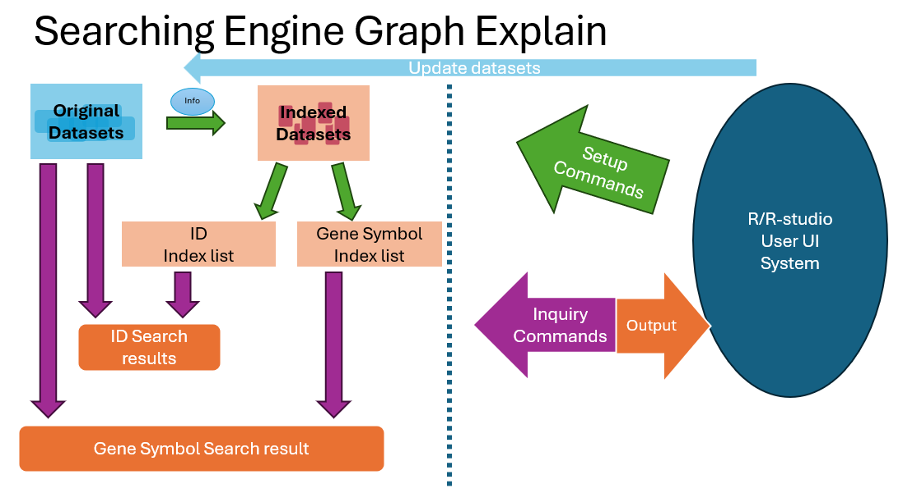
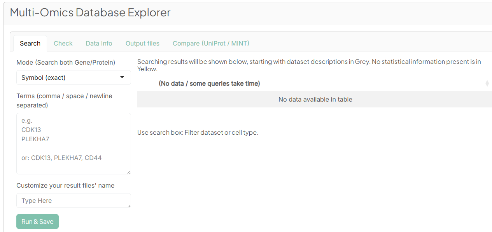
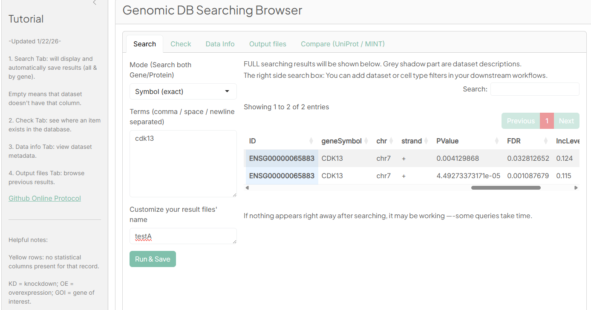
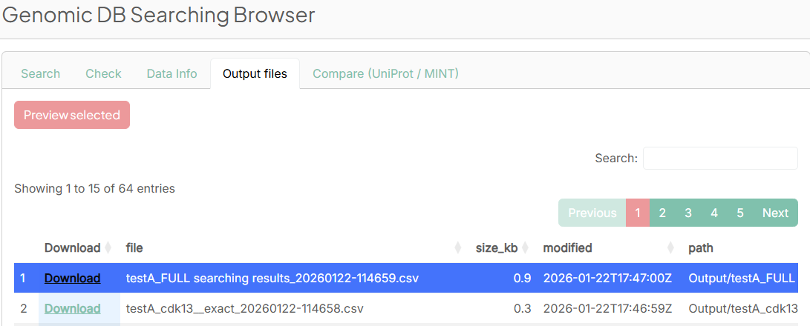
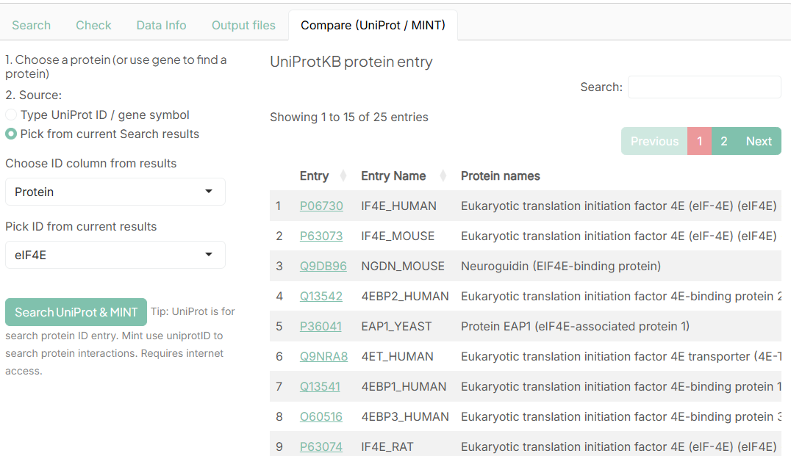
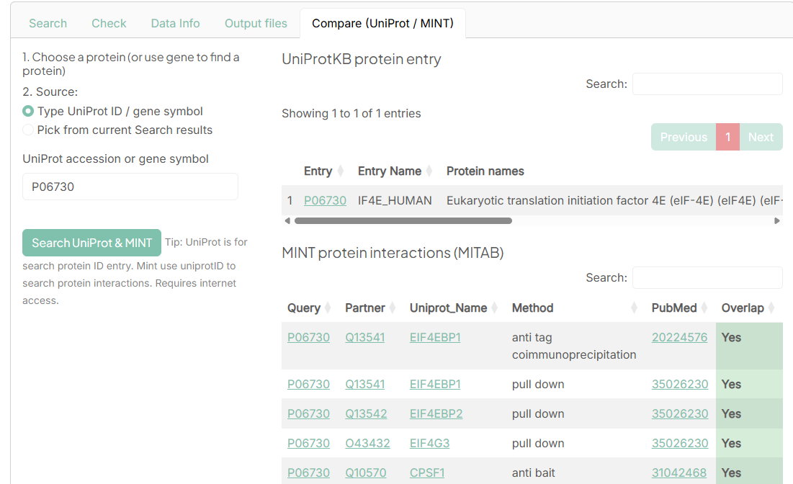
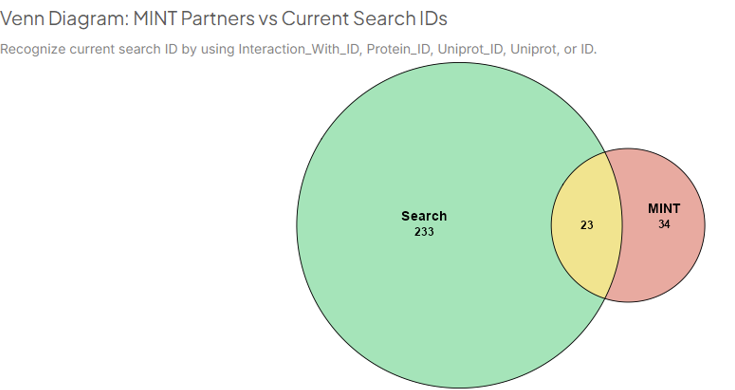

# 'XZDBfunction' R Package: Multi-Omices eXplore & Zoom Database Browser
- User-friendly Shiny-based web platform for [searching, annotating, and exporting](#browser-functions) multi-omics (genomic and proteomic) metadata across multiple datasets.
- Supporting genomic & protein interaction datasets. 
- Works on Windows, macOS, and Linux system, the only dependency is R. Easy to launch [instructions](#instructions-to-configure-local-quick-start) available.


| Overview | Start Page |
|---|---|
|  |  |


Please go to "Reference" page to check the list of analysis functions for statistical and biological analysis in this package.

## Quick Tour 
(*Contains setup code for R, launching the web browser directly with an example dataset*) 
```r
install.packages("remotes") # Skip this step if you already have "remotes" package
remotes::install_github("scottcalcalas/XZDBfunction")
library(XZDBfunction)

XZDB.Run() #Launch a demo (with example datasets)
```

## Setup Database 
(*Step-by-step setup instructions for R, and how to launch the database browser directly with example/your dataset*) 

### 1. Get protocol and set up your own database
```r
?xzdb.help()
xzdb.help() #Get protocols and setup instructions

# Transfer your datasets to the current folder, check everything is OK to run next step.
xzdb.input.all()    #Build the database in current folder and copy them to R package.
# After this step, R always uses your own dataset instead of the example dataset
```

([See details](#setup-a-new-database))

### 2. Launch the genomic website browser in two different ways

```r
XZDB.Run()                 # launches browser; if you already ran xzdb.input.all(), it will use your own dataset instead of the example dataset

XZDB.Run(use_current = T)  # Froce to run in current path. Require setup datasets in current path piror. Easy to modify and checking the database files.
```

---


## Browser Functions

 Please click on the following Protocols to view detailed instructions.
 
  - [1. Search](#function-1-Search)
  - [2. Check](#function-2-check)
  - [3. Load Data information](#function-3-data-information)
  - [4. Output Files](#function-4-output-files)
  - [5. Update Database](#function-5-update-database)
  - [6. UniProt / MINT Comparison](#function-6-uniprotmint-comparison)


### Function 1. Search

Go to the **Search** tab to obtain detailed search results.

<br>

Supported search options:

- Gene Symbol:      *exact* ,  *family*  ,  *fuzzy*
- Protein ID:       *exact match*
- ENSEMBL Gene ID:  *exact match*


*(Family search: seaching for gene/proteins start with the same letters but haveing different numbers at end. NCBP2 family search will also includes NCBP1.)*

*(Fuzzy search: use threshold of 0.1 to have a very permissive, broad search.)*

<br>

Example: exact searching **CDK13** and **NCBP2** returns all matching rows for either CDK13 or NCBP2 across all datasets.

The app generates three files to "Output" automatically:

- Full results        (Includes dataset description, the **same** you see at Search tab)
- Details for Gene 1  (list each entry from each dataset, Please download to see.)
- Details for Gene 2  (list each entry from each dataset, Please download to see.)

<br>



Each line represents a row found in our current database, with that database’s description at the beginning.

<br><br>

### Function 2. Check
Use the **Check** function to:
- See which datasets include a specific gene  
- Confirm if the gene exists in the database  


<br><br>

### Function 3. Data information
At the **Data info** tab, use **"Load Data info"** button to view dataset metadata and structure.


<br><br>

### Function 4. Output Files
Open the **Output files** tab to:
- Preview a result file (using the red *Preview Selected* button)  
- Download results (using the *Download* button in each row)

**Note:**  
Not all outputs can be previewed.  
The output folder should be cleared monthly to prevent slowdowns—please save results you want to keep in other folders.




<br><br>

### Function 5. Update Database
*(Optional — Administrator Operation locate at left panel)*


#### A. Update datasets:

After update new datasets folder and datasets information:

- `datasets/` folder
- `Datasets information.xlsx`

Run "Rebuild EVERYTHING" at Administrator Operations in the left panel:


<br>

#### B: Clean the output file & Check the log to debug:

Use the "Delete ALL Output files" button to clean the output folder. 
It's recommand every month to ensure the browser won't be slow to run. (It will load the entire output folder in the Output tab everytime.

<br>

If you find some issue when you're using the database browser, check the "Logs" at the bottom of left panel.


<br><br>

### Function 6. UniProt/MINT Comparison
- **UniProt:** retrieves possible protein (Search exactly by entering ID)
- **MINT:** retrieves protein–protein interaction data based on the UniProt result 

Requires an internet connection.

**If you search from current result:**


<br>

**If you type the ID:**


<br>

**The summary table and the Venn diagram will be like:**



<br><br>

---

## Setup a New Database

*(For package user to setup database inside R)*

To use helper to create your own dataset, run:
```r
xzdb.help()
xzdb.input.all()        # Run this after modifying the copied files
```

Synchronize all datasets and index files(include Datasets information.xlsx) into the package shinyapp directly
```r
xzdb.sync.to.shinyapp() #No need to run if you already run xzdb.input.all()
```

Get the currently used datasets inside the package location (If you want to confirm it's copied successfully)
```r
xzdb.nowDataset()          #It copies current using datasets to your working path
```

Example package storage location, inside R package:
```r
 R\R-4.4.3\library\XZDBfunction\shinyapp
```

*After those steps, start the browser and run "Rebuild EVERYTHING" at Administrator Operations.*


---

## Instructions to Configure Local Quick Start

(If you want to use it as one click, instead of opening R)

### *Steps:*
- [0. Configure R file](#0-configure-r-file)
- [1. Auto Start](#1-auto-start)
  - [On Windows](#on-windows)
  - [On Mac](#on-mac)
- [2.Start & Package Installation](#2start--package-installation)
- [3.Last Step](#3last-step)
- [Appendix — Windows & Mac Shortcuts](#appendix)


## 0. Configure R file

To make a quick start R file, put these two lines:
```r
library(XZDBfunction)
XZDB.Run()
```

For example, it can be called **Quick_Start.R**. The next step is just setting up to run this file using R (not RStudio).


## 1. Auto Start

*(Check examples at Appendix)*

*On Windows*: 

A desktop shortcut can automatically launch the Genomic DB Browser, as long as **R is installed**.


*On Mac*:

1. Ensure **R** is installed.  
2. Open the project folder.  
3. Double-click **MAC_Start.command**.
*If the Mac start script fails, use the backup version inside the `App_Info` folder.*


## 2.Start & Package Installation
On the first run, the script will automatically install any missing R packages.

Once installation finishes, the app will open in your browser automatically.


## 3.Last Step
After finishing:
- Close the browser tab  
- Close R / RStudio / Terminal


## *Appendix*

#### A1.Windows Shortcut Example
Modify the shortcut **Target** to point to Rscript and your Quick Start script: (For example:)
```
C:\Users\jcc1885\AppData\Local\Programs\R\R-4.4.3\bin\Rscript.exe "R:\Basic_Sciences\Pharm\Borden_Lab\borden\Database\Genomic result Browser\Quick Start.R"
```


#### A2.Mac “One-Click Start” Command File
Create a file named `something.command` (e.g. `MAC_Start.command`) on the Desktop:

```bash
#!/bin/bash
# Launch script
# ...
```
Then run
```bash
cd ~/Desktop
chmod +x something.command
```

After those steps, double-click the file to launch the website browser application.

#### A3. Update local R script (If you're using local based instead of package based)

Copy and replace your local scripts using the scripts at github location: XZDBfunction/inst/shinyapp/
